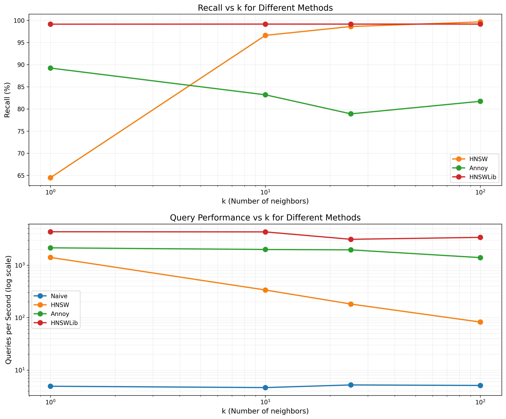
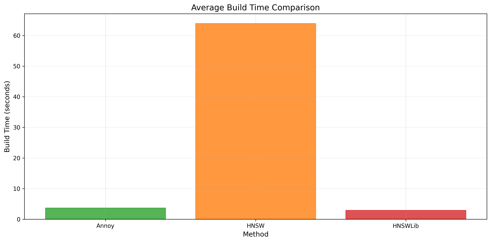

# Monotonic stack-HNSW vs. Annoy vs. Production HNSW vs. Naive Search Benchmark
**A Non-Standard HNSW Implementation for High-Recall Applications in ANN scenarios**  

## 📌 Overview  
This project benchmarks a **custom stack-based HNSW** against traditional ANN algorithms on Fashion MNIST:  
- **Monotonic stack-HNSW**: My parallel implementation with breadth-first search (no beam search)  
   - An alternative for traditional beam search with ordered stack traversal
   - Achieves **99.6% recall@100** on Fashion MNIST
   - Demonstrates the viability of simplified graph search paradigms
- **Annoy**: Spotify's tree-based ANN
- **Production HNSW**: Python's hyper-optimized HNSW library (hnswlib)  
- **Naive**: Brute-force baseline  

**Key Question**: *Can simplified graph traversal compete with production-grade ANNs?*  

---

## 🛠️ Methodology  
### 1. Algorithms  
| Algorithm | Key Features | Implementation |  
|-----------|--------------|----------------|  
| Stack-HNSW | Multi-threaded build (uses available CPU cores, benchmarking machine has 24), no beam search parameters | Custom C++ (see code) |  
| Annoy | `n_trees=10` (balances accuracy/speed) | [Spotify's Annoy](https://github.com/spotify/annoy) |  
| HNSWLib | `ef_construction=100`, `M=16`, `ef=50` | [hnswlib](https://github.com/nmslib/hnswlib) | 

### 2 Key Components
| Component | Purpose | Advantage |
|-----------|---------|------------|
| Monotonic Stack | Maintains search frontier | Memory locality |
| Ordered Set | Prepares next-layer candidates | Maintains node ordering in stack |
| Shared Mutex | Enables concurrent reads | Lock-free querying |

### The Main Idea
```cpp
while (not stack.empty()) {
    HNSWNode* current = stack.top();
    stack.pop();
    if (no_better_candidates(current)) {
        continue;  // Maintains monotonicity
    } else {
        ordered_set.insert(current)
        if (ordered_set.size() > k) ordered_set.remove(farthest_node_from_query)
        explore_better_neighbors(current);  // DFS-like expansion
    }
}
```

### 3. Dataset & Ground Truth  
- **Fashion MNIST**: 60K train vectors (784D) used as the search space, 10K test queries  
- **Preprocessing**: Values normalized to `[0, 255]` (space-separated files in `strategies\data\`)
  - `dataset.txt`: 60K training vectors
  - `queries.txt`: 10K query vectors
  - `topk.txt`: Ground truth top-100 neighbors for each query
- **Ground Truth**: Exact top-100 neighbors via brute-force (`strategies\data\groundTruth.c++`)

### 4. Key Ideas  
- **(Simulated) DFS Graph Traversal**: Replaces beam search priority queues with simple monotonic stacks  
- **Lock-Free Reads**: `shared_mutex` enables concurrent queries of nearest neighbors during insertion  

### 5. Things To Consider
- **Benchmarking**: All queries are done sequentially, because optimization via parallelization may yield varying degrees of benefit for each algorithm

---

## 📊 Results  
### Performance Comparison  
#### CPU: 13th Gen Intel(R) Core(TM) i7-13700K
| Method   | k   | Build Time (s) | Query Time (μs) | QPS (aggregate)  | Recall (%) |  
|----------|-----|------------|-----------------|-------|------------|  
| Naive    | 100 | 0        | 196,306         | 5     | 100.00     |  
| Stack-HNSW | 100 | 54.4   | 12,148          | 82    | **99.64**  |  
| Annoy    | 100 | 3.7      | 718             | 1,393 | 81.71      |  
| HNSWLib  | 100 | 3.0      | 296             | 3,383 | 99.15      |  

  
*Stack-HNSW achieves near-perfect recall at scale despite simpler design.*

  
*Stack-HNSW lags significantly because of its simplicity and lack of optimization*

### 🔍 Insights  
1. **Monotonic Stack Trade-offs**:  
   - ✅ **99.6% recall@100**: My stack-HNSW may have some usecases where k is large, recall is paramount, but query/build times are not too important (outperforms both Annoy and hnswlib)
      - This means that **Beam Search is not mandatory**
   - ⚠️ **64.5% recall@1** (vs. 99.1% for HNSWLib), although many (~92%) are in the top-10 nearest
   - ⚠️ **Scaling Behavior** O(k log d), compared to O(log kd) for logarithmic using beam search
2. **Annoy's Limits**: 81.7% recall@100 shows tree-based ANN struggles in high dimensions
3. **Build Time**: Searching for neighbors in parallel during build and connecting neighbors serially probably has more benefits in machines with more cores; (54s vs. Annoy's 3.7s) lags significantly behind HNSWLib on my machine with less cores
4. **Possible Optimizations**: Runtime can be improved such as by tuning the max number of layers or the indegree of each node at each layer, or using a hybrid approach between my stack approach and beam search for different thresholds of k

---

## 🔧 Technical Lessons  
1. **Debugging Wins**:  
   - Fixed unsafe parallel access of data structures in 24-thread graph construction by serializing edge addition
   - Discovered QPS calculation error through validating results with theory  
2. **Algorithmic Insights**:  
   - Stack-based HNSW recall improves with `k` (64.5% → 99.6%)  
   - Unprioritized search hurts single-neighbor accuracy  
3. **Scaling For Production**
   - Techniques used in competitive programming are less applicable to production environments
   - Same goes for the reverse: production techniques incur errors which are unacceptable in competition conditions

---

## 🎓 Future Work
- **Testing on Other Datasets**: Benchmark performance of larger or lower-dimension datasets with the other methods
- **Further Optimization**: To see whether recall can be maintained while improving query times
- **Parallelization on Queries**: Investigate whether splitting queries across cores offers a speedup

---

### 🚀 How To Reproduce

1. Clone this repo
2. Install Python dependencies:
   ```bash
   pip install numpy pandas matplotlib annoy hnswlib
   ```
3. Run benchmarks:
   ```powershell
   # Compile and run C++ implementations
   g++ strategies\naive.c++ -o strategies\naive.exe
   g++ strategies\grader_hnsw.cpp -o strategies\grader_hnsw.exe
   strategies\naive.exe
   strategies\grader_hnsw.exe

   # Run Python implementations
   python strategies\annoybench.py
   python strategies\hnswbench.py
   ```
Note: All benchmarks are configured for k=100 nearest neighbors by default.

## Dependencies  
### C++
- GCC 12+ with C++17 support
- Standard Template Library (STL)

### Python
- Python 3.8+
- NumPy
- Pandas
- Matplotlib
- Annoy (Spotify's ANN library)
- hnswlib (Production HNSW implementation)

---

### 📖 References
- Malkov, Y.A., Yashunin, D.A. (2016). Efficient and robust approximate nearest neighbor search using Hierarchical Navigable Small World graphs. arXiv preprint [arXiv:1603.09320](https://arxiv.org/abs/1603.09320).
